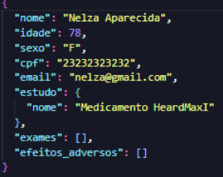

# PIM III (Projeto Integrado Multidisciplinar III)

## O que é o PIM?
O PIM (Projeto Integrado Multidisciplinar), tem como o objetivo integrar conhecimentos obtidos com as aulas práticas e teóricas do curso superior Analise e Desenvolvimento de Sistemas no desenvolvimento de um sistema funcional e seguro que cumpre com as normas de cuidado com o meio ambiente e auxilia no desenvolvimento e testes funcionais.

## Sobre o Sistema Desenvolvido
O sistema foi desenvolvido com o propósito de apoiar estudos em análises clínicas, promovendo também o cuidado ambiental. O sistema permite o controle de pacientes, exames laboratoriais e o rastreio de ações e processos de produção de forma integrada e segura.

Sua estrutura utiliza Python no back-end, garantindo eficiência no processamento e na organização das informações. Os dados são inseridos por meio do cadastro de pacientes e passam por etapas de controle e análise na plataforma. Além disso, o sistema adota boas práticas de conformidade com normas da área farmacêutica e de pesquisa clínica, assegurando rastreabilidade, auditoria e controle de acesso.

## Tecnologias Utilizadas
- **Linguagem:** Python  
- **Armazenamento:** JSON (simulando base de dados)  
- **Arquitetura:** Estrutura modular e orientada a arquivos  
- **Segurança:** Criptografia de senha com *bcrypt*  
- **Boas práticas:** Registro de histórico e controle de login/logout 

## Interface UI Inicial do Usuário

## Interface UI de Cadastro do Usuário

## Usuário Salvo no Arquivo .json (Simulando os dados salvos no Banco de Dados)

## Rastreio de Ação do Usuário

## Interface UI de Cadastro de um Novo Estudo

## Estudo Salvo no Arquivo .json (Simulando os dados salvos no Banco de Dados)

## Rastreio de Ação do Usuário

## Interface UI de Cadastro de um Novo Paciente

## Paciente Salvo no Arquivo .json (Simulando os dados salvos no Banco de Dados)

## Rastreio de Ação do Usuário

## Paciente com os Exames ja Feitos (Simulando os dados salvos no Banco de Dados)

## Rastreio de Ação do Usuário

